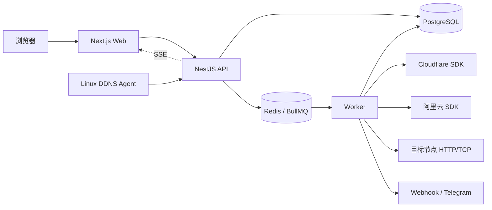
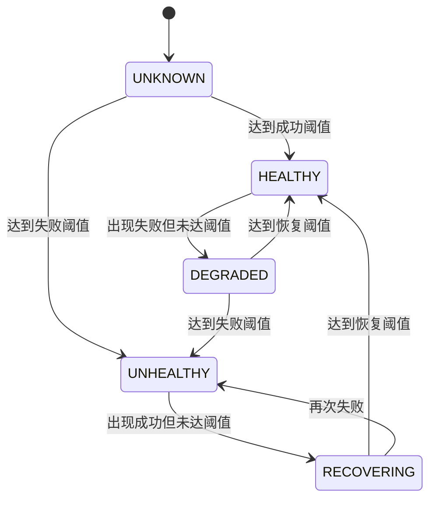
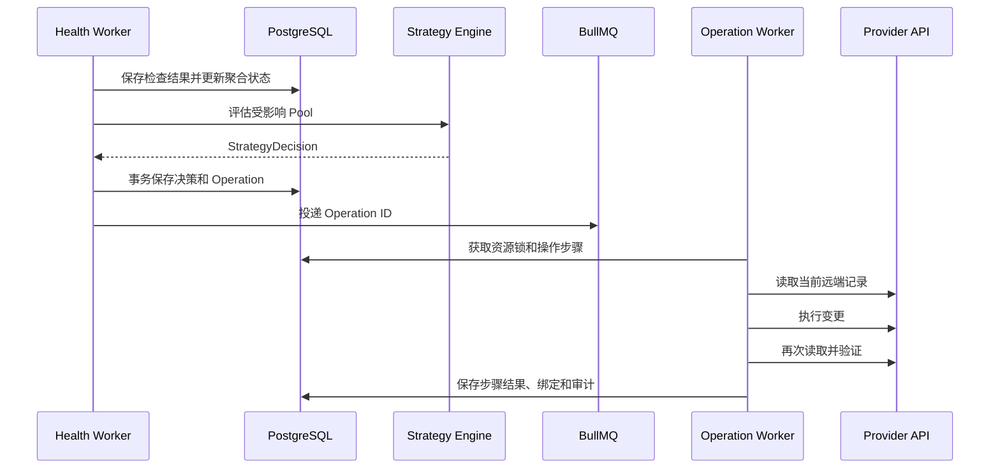

# MasterDNS 系统架构设计

## 1. 架构原则

- 模块化单体优先，保持部署和本地开发简单。
- Web 请求与后台自动化分离，页面重启不影响健康检查。
- PostgreSQL 是持久状态和操作状态的唯一事实来源。
- Redis 仅用于任务分发、短期去重和分布式锁，数据丢失后可从数据库恢复。
- 所有厂商差异必须停留在 Provider Adapter 内。
- 所有健康检查差异必须停留在 Health Checker 内。
- 策略只消费标准化健康状态，不直接发网络请求或调用云厂商。
- 每次 DNS 写操作均经过 Operation 状态机，具备幂等、验证和审计能力。

## 2. 技术栈

| 层 | 选择 |
| --- | --- |
| Monorepo | pnpm workspace |
| Web | Next.js App Router、React、TypeScript |
| API | NestJS、Fastify Adapter |
| Worker | NestJS standalone application |
| 数据库 | PostgreSQL、Drizzle ORM |
| 队列与锁 | Redis、BullMQ |
| HTTP 客户端 | Undici |
| TCP 检查 | Node.js `net.Socket` |
| 密码 | Argon2id |
| 凭证加密 | AES-256-GCM |
| 实时更新 | Server-Sent Events |
| 测试 | Vitest、浏览器回归、真实 Provider 隔离脚本 |
| 部署 | Docker Compose |

## 3. 代码组织

```text
apps/
├── web/                  # Next.js 控制台
├── api/                  # REST API、认证、资源校验、SSE
└── worker/               # 检查、同步、调度、DNS 写入、通知
packages/
├── db/                   # Drizzle schema、migration、repository
├── providers/            # Provider 接口及 Cloudflare/阿里云实现
├── checkers/             # HTTP、TCP Checker 及扩展注册表
├── automation/           # 健康状态和 Pool 策略状态机
├── crypto/               # 凭证加解密、Token hash、签名
└── contracts/            # DTO、事件、内部错误码
```

## 4. 运行时拓扑



Web 不直接连接数据库或厂商。API 不执行长期检查。Worker 不接受外部用户请求。

## 5. 领域模块

### 5.1 Identity

- 管理本地用户、角色和会话。
- 首个管理员通过部署环境初始化。
- 每次资源访问同时检查角色和所有权。
- 管理员跨用户操作必须记录目标用户和管理员身份。

### 5.2 Provider Accounts

- 验证、加密和轮换 Cloudflare/阿里云凭证。
- 接入与轮换时短暂验证明文凭证；后续仅在 Worker 调用厂商时解密。
- 账号停用后停止同步和写操作，但保留历史。

### 5.3 DNS Inventory

- 同步 Zone 和记录的标准化副本。
- 保存远端 ID、字段、厂商元数据和内容摘要。
- 区分普通记录与受自动化管理的记录。
- 对普通记录接受外部变化；对受管记录产生漂移事件。

### 5.4 Health

- 调度检查任务并调用 Checker。
- 保存原始结果并计算连续成功/失败次数。
- 只有聚合状态发生变化时产生 `EndpointHealthChanged` 事件。

### 5.5 Automation

- 根据 Pool 类型、调度方式、当前绑定和健康状态生成 Desired Assignment。
- 不直接调用 Provider。
- 输出不可变的 `StrategyDecision`，由 Operation 模块执行。

### 5.6 Operations

- 将一个用户动作或自动化决策拆分成多个厂商写步骤。
- 负责幂等键、重试、远端验证、部分成功和最终状态。
- 更新本地 DNS 副本前必须获得远端确认。

### 5.7 DDNS

- 一次性安装 Token 兑换节点运行 Token。
- 接收 Agent heartbeat 和候选地址。
- 对候选地址执行健康检查，成功后生成地址提升及 DNS Operation。
- Agent Token 只保存哈希，不能被服务端回显。

### 5.8 Notifications

- 消费领域事件，按用户默认和 Pool 覆盖配置生成投递任务。
- Webhook 负责签名、重试和投递历史。
- Telegram 负责消息格式、测试通知和错误归类。

## 6. 扩展接口

### 6.1 Provider Adapter

```ts
interface DnsProviderAdapter {
  readonly provider: "cloudflare" | "aliyun";
  verifyCredentials(): Promise<CredentialCapabilities>;
  listZones(cursor?: string): Promise<Page<ProviderZone>>;
  listRecords(zoneId: string, cursor?: string): Promise<Page<ProviderRecord>>;
  getRecord(zoneId: string, recordId: string): Promise<ProviderRecord | null>;
  createRecord(zoneId: string, input: RecordInput): Promise<ProviderRecord>;
  updateRecord(zoneId: string, recordId: string, input: RecordInput): Promise<ProviderRecord>;
  deleteRecord(zoneId: string, recordId: string): Promise<void>;
}
```

适配器将厂商错误转换为统一分类：

- `authentication_failed`
- `permission_denied`
- `not_found`
- `conflict`
- `validation_failed`
- `rate_limited`
- `transient_failure`
- `unknown_provider_error`

Cloudflare 使用官方 `cloudflare` TypeScript SDK；阿里云使用官方 Node.js/TypeScript V2 SDK。业务层不构造厂商签名和原始 HTTP 请求。

### 6.2 Health Checker

```ts
interface HealthChecker<TConfig> {
  readonly type: string;
  validate(config: unknown): TConfig;
  check(target: CheckTarget, config: TConfig, signal: AbortSignal): Promise<CheckResult>;
}
```

第一版注册 `http` 和 `tcp`。Checker 返回统一的成功状态、延迟、时间和脱敏错误信息。

### 6.3 Failover Strategy

```ts
interface FailoverStrategy {
  readonly type: "primary_backup" | "healthy_set" | "assignment_pool";
  evaluate(context: StrategyContext): StrategyDecision;
}
```

策略计算必须是无网络副作用的确定性逻辑。随机策略使用事件 ID 派生的种子，以便审计和测试时重现选择结果。

## 7. 健康状态机



只有进入或离开 `UNHEALTHY`、进入 `HEALTHY` 等有效状态变化才触发调度和即时通知。单次失败只更新结果，不执行 DNS 切换。

## 8. 自动切换流程



### 8.1 并发控制

- 每个 Pool 同时只允许一个 reconcile。
- 每个 Zone 的写操作串行化，避免同一远端记录竞争。
- Operation 使用数据库唯一幂等键；Redis 锁只是性能优化。
- Worker 获取任务后先比较期望版本，过期决策直接标记 `superseded`。
- 先持久化 Operation/Delivery 状态，再投递队列；Worker 周期扫描数据库恢复未完成任务。

### 8.2 重试原则

- 读取、覆盖更新和删除可以针对临时错误退避重试。
- 创建操作发生超时后，必须先按预期字段查询远端，避免重复创建。
- 收到厂商限流时遵守 `retry-after` 或 SDK 返回的等待信息。
- 认证和权限错误不自动持续重试，账号进入需处理状态并发送告警。

## 9. DDNS Agent 协议

### 9.1 安装

一次性安装 Token 有短有效期、只能兑换一次，并绑定用户、Pool 和 Endpoint。兑换后返回运行 Token；服务端仅保存运行 Token 哈希。

### 9.2 Heartbeat

```http
POST /api/v1/ddns/heartbeat
Authorization: Bearer <runtime-token>
Content-Type: application/json

{
  "ipv4": "203.0.113.10",
  "ipv6": "2001:db8::10",
  "hostname": "server-a",
  "agentVersion": "1.0.0"
}
```

- 未显式提供地址时，API 可采用可信代理链解析后的来源地址。
- 反向代理可信网段必须显式配置，不能无条件信任 `X-Forwarded-For`。
- 地址未变化时只更新 `last_seen_at`，不创建 DNS Operation。
- 新地址先成为 candidate，通过检查后再成为 current。

## 10. 安全设计

### 10.1 凭证

- AES-256-GCM 加密，随机 IV，每条记录保存认证 Tag 和 Key Version。
- 主密钥通过部署 Secret 注入，不存入数据库、镜像或 Git。
- 日志拦截器统一移除 Authorization、Cookie、Token、AccessKeySecret 和加密前凭证。
- Cloudflare Debug 日志在生产环境关闭，避免请求体暴露。

### 10.2 Web

- HttpOnly、Secure、SameSite Cookie。
- 状态修改请求使用 CSRF 防护和 Origin 校验。
- 登录、DDNS 和写接口分别限流。
- 高风险操作要求重新输入资源名或明确二次确认。
- 所有 DTO 进行白名单验证，不透传未识别字段到厂商 SDK。

### 10.3 Webhook

- 使用用户配置 Secret 对时间戳和原始请求体做 HMAC-SHA256。
- 请求包含事件 ID 和时间戳，接收方可防重放和去重。
- 响应正文只保存截断且脱敏的片段。

## 11. 可观测性

- 结构化日志关联 `request_id`、`operation_id`、`event_id`、`pool_id`，不记录 Secret。
- 指标覆盖检查次数/延迟、状态变化、队列积压、Provider 错误、切换耗时和通知失败。
- SSE 推送 Operation、Pool 和 Endpoint 的状态变化；断线后客户端按事件游标补拉。
- 健康检查高频结果与不可变审计日志分开存储和保留。

## 12. 部署

Docker Compose 默认包含：

```text
masterdns-web
masterdns-api
masterdns-worker
postgres
redis
```

API 和 Worker 使用相同镜像的不同启动命令亦可。数据库 migration 作为独立一次性任务执行。服务启动时扫描 `pending/running` 且租约过期的 Operation，并恢复任务；扫描所有已启用检查并恢复调度。

## 13. 后续扩展

- 多 Probe 探测和按多数结果聚合。
- ICMP、DNS、gRPC 和自定义脚本 Checker。
- KMS/Vault 信封加密和密钥轮换。
- TOTP、OIDC 和团队资源共享。
- 更复杂的容量、权重和地域线路调度。

## 14. 官方实现依据

- [Cloudflare TypeScript SDK](https://developers.cloudflare.com/api/typescript)
- [Cloudflare DNS Record API](https://developers.cloudflare.com/api/typescript/resources/dns/subresources/records/methods/update)
- [Cloudflare API Rate Limits](https://developers.cloudflare.com/fundamentals/api/reference/limits/)
- [阿里云 DNS OpenAPI](https://api.aliyun.com/document/Alidns/2015-01-09)
- [阿里云 Node.js/TypeScript SDK](https://help.aliyun.com/en/sdk/developer-reference/node-js-sdk/)
- [阿里云 DNS API 流控](https://help.aliyun.com/zh/dns/api-alidns-2015-01-09-quota)
- [Telegram Bot API](https://core.telegram.org/bots/api)
