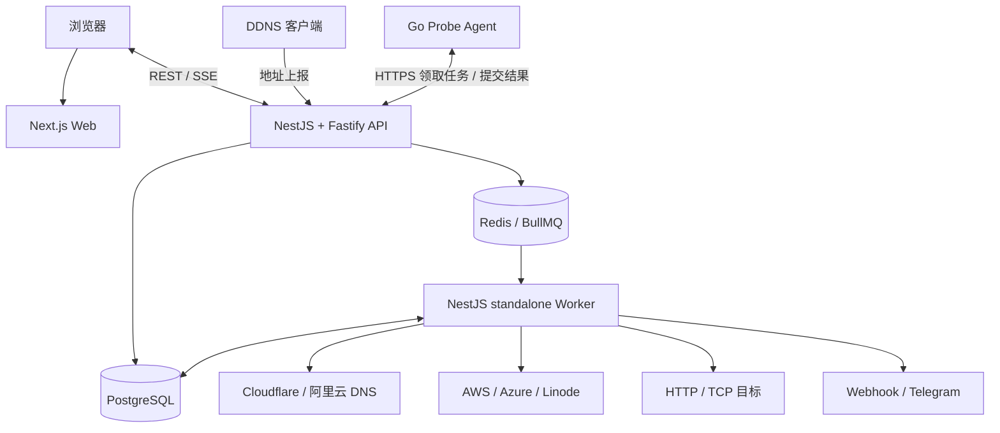
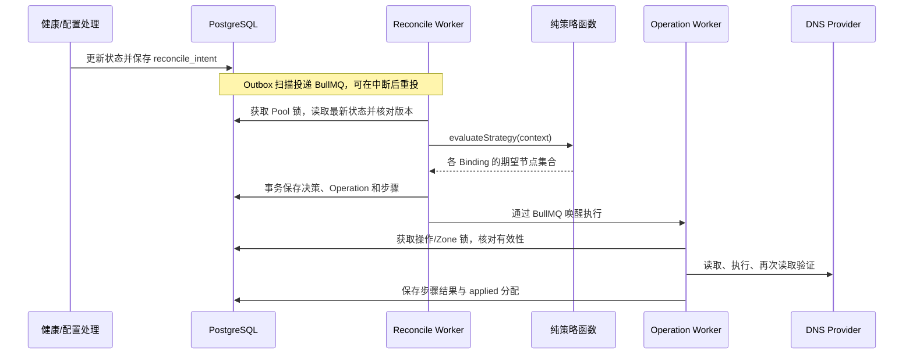
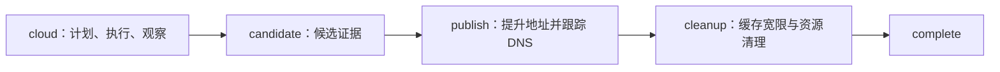

# MasterDNS 系统架构

本文描述截至 2026-10-05、代码基线 `cc4b90d` 的实际实现。功能实现、自动化测试、真实云验收和生产部署是不同状态；本文不替代[验收计划](TEST_PLAN.md)和 `validation/` 中按提交记录的证据。

## 1. 系统定位与边界

MasterDNS 是以 DNS 发布为出口的健康检查、故障转移、DDNS 和多云地址管理平台。当前采用模块化单体：Web、API、Worker 分进程部署，API 和 Worker 共享 PostgreSQL、领域契约和适配器代码。业务模块没有独立数据库，也没有通过服务间 RPC 隔离。

系统已经实现 DNS 管理、Pool 策略、外部多探针聚合、云资源发现、受限 IP 换址、实例启停/删除、月流量停机策略、通知与审计。各厂商的支持条件不同，不能把统一接口理解为所有实例都具有相同能力。

| 仓库/组件 | 当前职责 | 与平台的关系 |
| --- | --- | --- |
| MasterDNS | 控制台、API、后台自动化、持久状态 | 主仓库 |
| 主仓库 `agent/` | Linux DDNS 客户端，报告自身地址 | 通过 DDNS API 接入 |
| MasterDNS-Agent | Go HTTP/TCP 外部探测器 | 主动通过 HTTPS 领取任务并上报结果，不持有云/DNS 凭证 |
| MasterDNS-Ansible | Python 配置编译、Ansible 建机与业务配置部署 | 独立仓库；平台尚未接入其账号池调度、到期补建和 Pool/DNS 发布闭环 |

Linode 换址过程中创建临时实例，是特定换址流程的一部分，不代表平台已具备通用业务节点创建与部署编排能力。

## 2. 运行结构与技术栈


```mermaid
flowchart TB
    B[浏览器] --> W[Next.js Web]
    B <-->|REST / SSE| A[NestJS + Fastify API]
    D[DDNS 客户端] -->|地址上报| A
    P[Go Probe Agent] <-->|HTTPS 领取任务 / 提交结果| A
    A --> DB[(PostgreSQL)]
    A --> Q[(Redis / BullMQ)]
    Q --> K[NestJS standalone Worker]
    K <--> DB
    K --> DNS[Cloudflare / 阿里云 DNS]
    K --> C[AWS / Azure / Linode]
    K --> T[HTTP / TCP 目标]
    K --> N[Webhook / Telegram]
```

- pnpm workspace，Node.js 22+；版本约束见[根 package.json](../package.json)。
- Web：Next.js 16、React 19；页面通过 `NEXT_PUBLIC_API_URL` 请求 API，不直接访问数据库。
- API：NestJS 11、Fastify；全局 `/api` 前缀，Cookie 会话、Origin 校验、限流和资源权限检查。
- Worker：NestJS standalone application；BullMQ 消费者与定时数据库扫描并存，不接受外部 HTTP 请求。
- 持久化：PostgreSQL、Drizzle ORM；Redis 用于队列、限流和部分分布式锁。
- 部署：[Docker Compose](../docker-compose.yml) 中 Web、API、Worker、PostgreSQL、Redis 常驻，`migrate` 为一次性迁移和空库管理员初始化任务。

API 除配置和任务创建外，也执行凭证验证、资源预检等必要的厂商调用；长流程由 Worker 推进。PostgreSQL 保存平台的持久事实，远端云/DNS 的实际效果仍必须通过厂商接口观察确认。

## 3. 代码分层与实际依赖

```text
apps/web       页面、表单、会话、数据请求与刷新
apps/api       接口、授权、配置、任务入口、Agent 协议
apps/worker    调度、协调、执行、观察、恢复、清理
packages/
  contracts        类型、Zod 校验、任务协议、错误定义
  automation       Pool 策略、健康/换址状态机、探测共识；另含 Redis 锁辅助
  db               schema、迁移、数据库连接、共享事务与领域状态操作
  providers        DNS 适配器：Cloudflare / 阿里云
  cloud-providers  云资源、能力检查、换址计划、执行与观察
  checkers         HTTP / TCP 检查与网络目标策略
  crypto           密码、Token、凭证加解密和签名工具
```

`web` 的内部包依赖是 `contracts`；API 和 Worker 都依赖其余领域/基础包。`contracts` 位于依赖底部。`automation` 中的决策函数只消费传入快照，但整个包并非完全无基础设施代码，因为还导出 DNS Zone/Redis 锁工具。

这是按模块组织的服务层架构，并非严格的六边形架构：API、Worker Service 直接通过 Drizzle 查询共享表；`db` 已承载换址上下文、健康证据、预算和生命周期事务规则。理解一条写路径通常需要同时阅读 Service、共享事务函数和适配器。

## 4. 领域对象与状态归属

| 领域 | 核心对象 | 负责的事实 |
| --- | --- | --- |
| 身份与授权 | User、Session、InstanceAuthorization | 谁能访问资源，允许哪些云端副作用 |
| DNS 清单 | ProviderAccount、Zone、DnsRecord | DNS 厂商账号及已观察到的记录副本 |
| DNS 调度 | Pool、Endpoint、DomainBinding、BindingAssignment | 域名应由哪些节点提供地址，哪些分配已执行 |
| 健康 | CheckConfig、AddressHealthPolicy、ProbeRound、Observation | 某个地址/配置版本在某次检查中是否可达 |
| 云资源 | CloudAccount、Instance、Interface、Address、Slot | 云端清单和被平台管理的稳定地址位置 |
| DNS 操作 | Operation、OperationStep | 一次 DNS 变更的意图、步骤、执行和验证结果 |
| 云换址 | Incident、Attempt、Step、Publication、Resource | 换址尝试、云端结果、DNS 发布及旧资源清理 |
| 实例生命周期 | LifecycleOperation、InstanceControl、TrafficStopPolicy | 启停/删除过程，以及手动停机或流量停机约束 |
| 通知与审计 | Delivery、AuditLog、FailoverEvent | 对外投递进度及操作历史 |

### 4.1 Pool、Endpoint、Binding

Pool 是策略容器，Endpoint 是可被选择的逻辑节点；Endpoint 可以来自静态地址、DDNS 或云地址。DomainBinding 把一个 Zone 内的域名和 A/AAAA 类型绑定到 Pool。BindingAssignment 分别记录 `desired` 与 `applied`，因此期望分配可以领先于厂商实际结果。

三种策略为 `primary_backup`、`healthy_set`、`assignment_pool`；选择方式包括顺序、稳定伪随机、轮询和最少绑定。恢复策略、冷却期、地址族和 Binding 专属健康参与协调。全池无健康候选时，策略保留已有分配并报告问题。

### 4.2 云实例、地址槽位与发布地址

云资源链为 `Account → Instance → Interface → Address`。Slot（`managed_address_slots`）代表某个接口和地址族下的受管位置，保存 current/candidate 地址及版本。IP 会变化，Slot 身份可以持续不变。

`cloud_endpoint_links` 将 Slot 按地址族接到 Endpoint；`endpoint_addresses` 是供 Pool/DNS 使用的节点地址视图。库存扫描发现一个 IP，不等于这个 IP 已被授权、验证或发布。清单、健康证据、发布和 DNS applied 状态必须分开判断。

表结构与约束见[数据模型](DATA_MODEL.md)。

## 5. 健康判定：观测、共识、状态三层

### 5.1 本地检查与外部探测

Worker 的 HealthScheduler/HealthProcessor 执行本地 HTTP/TCP 检查。外部探测使用另一条持久任务路径：ProbeScheduler 建立数据库轮次和任务，Agent 通过 API 领取租约，再回传结果；Agent 不直接读取 Redis。

ProbeRound 冻结地址、地址版本、检查配置版本、策略/探针组版本、成员集合、截止时间和证据过期时间。API 验证任务、租约、身份和结果上下文，数据库事务负责接收和应用轮次；Worker 也负责截止轮次收束与本地观测。

### 5.2 探针不可用不等于目标故障

单个探针结果区分 `success`、`failure`、`unavailable`。`evaluateProbeRound` 根据有效样本数及 `any/majority/all/at_least/specified` 规则得到 `success/failure/unknown`。其中投票模式描述故障判定规则，例如 `any` 表示有有效失败票即可判失败，但仍须满足 `minimumValid`。

`advanceRoundHealth` 将一轮结果应用到连续成功/失败计数；未知轮次清空连续计数，保留既有聚合健康状态。重复轮次不重复计数。因而“页面仍显示上一健康状态”并不意味着最新证据仍足以授权发布。

### 5.3 健康状态与证据新鲜度

`applyHealthResult` 实现 `unknown/healthy/degraded/unhealthy/recovering` 五态转换。失败阈值和恢复阈值用于抑制抖动；阈值为 1 时单次有效失败也可直接进入 unhealthy。Pool 策略允许 healthy/degraded 候选，具体协调仍受其他条件约束。

健康不是节点上的一个永久布尔值。地址、配置或策略变化后，旧成功不能证明新地址可用；自动云地址发布会再次检查匹配版本、最新轮次和证据有效期。

代码入口：[健康状态机](../packages/automation/src/health-state.ts)、[探针共识](../packages/automation/src/probe-consensus.ts)、[轮次事务](../packages/db/src/probe-rounds.ts)。

## 6. DNS 调度与执行


```mermaid
sequenceDiagram
    participant H as 健康/配置处理
    participant DB as PostgreSQL
    participant R as Reconcile Worker
    participant S as 纯策略函数
    participant O as Operation Worker
    participant P as DNS Provider
    H->>DB: 更新状态并保存 reconcile_intent
    Note over DB,R: Outbox 扫描投递 BullMQ，可在中断后重投
    R->>DB: 获取 Pool 锁，读取最新状态并核对版本
    R->>S: evaluateStrategy(context)
    S-->>R: 各 Binding 的期望节点集合
    R->>DB: 事务保存决策、Operation 和步骤
    R->>O: 通过 BullMQ 唤醒执行
    O->>DB: 获取操作/Zone 锁，核对有效性
    O->>P: 读取、执行、再次读取验证
    O->>DB: 保存步骤结果与 applied 分配
```

- `ReconcileOutboxService` 扫描 `reconcile_intents`，弥合数据库提交与队列投递之间的故障窗口。
- `ReconcileProcessor` 使用 Pool 的 PostgreSQL advisory transaction lock，检查策略/决策版本，并调用无网络副作用的 `evaluateStrategy`。
- `OperationProcessor` 通过 Operation 幂等键、步骤状态、Redis 租约和 DNS Zone 锁控制重复与并发写入；过期任务可被 supersede。
- 操作可能 partial：已成功步骤与失败步骤分别保存，恢复不能简单地从第一步重放。
- 同步器更新 DNS 清单并处理受管记录漂移；它与写入路径共享 Zone 锁规则。

数据库与厂商之间没有分布式事务。系统采用持久意图、幂等、防并发和远端读回验证来逐步收敛；不能承诺任意云/DNS 请求具有全局 exactly-once 语义。

代码入口：[协调器](../apps/worker/src/automation/reconcile.processor.ts)、[DNS 执行器](../apps/worker/src/operations/operation.processor.ts)、[Outbox](../apps/worker/src/automation/reconcile-outbox.service.ts)。

## 7. 云换址：持久状态机与副作用执行

### 7.1 四层分工

1. **决策**：`nextRotationAction(snapshot, now)` 只判断下一步应等待、执行、观察、探测、发布、清理、暂停还是完成。
2. **存储与准入**：`RotationStore` 和 `db` 事务读取一致上下文，检查授权、预算、版本、租约，保存意图与回执。
3. **执行与观察**：`RotationProcessor` 调用 `CloudAdapter.execute/observeDetails`；厂商适配器处理云端 API、身份和能力差异。
4. **发布与清理**：PublicationService 连接云地址和 Pool/DNS Operation；CleanupService 管理旧地址、失败候选和临时资源的后续清理。

### 7.2 正常阶段与触发方式


```mermaid
flowchart LR
    C[cloud：计划、执行、观察] --> V[candidate：候选证据]
    V --> P[publish：提升地址并跟踪 DNS]
    P --> R[cleanup：缓存宽限与资源清理]
    R --> F[complete]
```

上图是自动换址正常路径，等待、暂停、失败和观察恢复可发生在中间阶段。事件 `status`（active/paused/exhausted/complete）与 `phase` 独立保存，终止另有 `terminated_at`，不能只根据阶段推断成功。

- `health`：合格的外部故障证据触发。
- `scheduled`：独立周期计划触发，仍要求相应授权与候选验证。
- `manual`：当前支持 AWS EC2/Lightsail 和 Linode 的手动 IPv4 换址；无需开启自动轮换或配置外部探测。观察云端新地址后可走专门发布路径，不伪造健康成功证据。

绑定/监控本身也不要求开启自动换址。Publication 可以没有 Incident，以支持首次云地址绑定后的验证与发布。

### 7.3 为什么要先保存 in_flight，再请求云端

云请求可能已生效，但响应丢失或进程在保存回执前崩溃。系统先持久化步骤计划和派发状态，再执行远端副作用。恢复时优先观察原步骤的实际效果；明确无副作用的拒绝才允许按规则重新派发，身份/效果不确定时保留 ambiguous 或暂停。

一次 Incident 下有预算段、Attempt 和多个 Step。换址次数按尝试的效果记账，恢复已有尝试不应被计为一次新换址。账号/服务层面的速率预算另由 `cloud_rotation_*` 表控制。

### 7.4 并发与旧任务隔离

- `physicalKey` 由厂商、外部账号、服务、区域、实例远端 ID 组成。同一实际实例即使通过不同本地账号别名访问，也需按物理身份协调。
- `rotation_leases` 保存 holder、到期时间和递增 revision；步骤保存 fence。租约持有者和版本用于拒绝旧执行者继续推进本地状态。
- 授权、换址策略、地址、健康配置和探针组均有版本；派发和发布前重新比较，配置撤销不能只在 API 请求入口检查一次。
- 实例启停/删除与换址互相约束，手动停机或流量停机有持久 hold 状态。

这些机制控制平台内的并发，不提供云厂商不支持的外部原子 CAS。Azure NIC 和 Linode 分配/重启的恢复边界分别见 [Azure](providers/azure.md)、[Linode](providers/linode.md)。

### 7.5 DNS 发布和旧资源清理

云端换址成功、DNS 发布成功和旧资源清理成功是三个独立结果。Publication 按 Slot/addressVersion 记录子 Pool 决策及 Operation，避免把 DNS 部分成功当作整体完成。清理还要检查授权、资源归属、引用及缓存宽限期。

Linode `instance_swap` 通过同区域临时实例交换 IPv4，保留生产实例和磁盘；临时实例的身份证据保存在步骤回执及资源快照中。终止或失败不代表临时资源已经删除。默认 `additional_ipv4` 路径仍存在，两种策略均受能力与授权限制。

代码入口：[换址状态机](../packages/automation/src/rotation-machine.ts)、[Store](../apps/worker/src/rotation/rotation-store.ts)、[Processor](../apps/worker/src/rotation/rotation.processor.ts)、[发布](../apps/worker/src/rotation/rotation-publication.service.ts)、[清理](../apps/worker/src/rotation/rotation-cleanup.service.ts)。

## 8. 后台调度、恢复与通知

[QueueRuntimeService](../apps/worker/src/queue-runtime.service.ts) 创建 DNS sync、health、reconcile、operations、cloudSync、rotation、notifications 七类队列。Worker 同时运行检查调度、换址恢复/周期调度、发布/清理、生命周期、通知状态和数据保留扫描。

外部 Probe 的任务租约保存在 PostgreSQL；实例生命周期操作也通过数据库扫描和租约领取。不能把所有后台工作都理解为 BullMQ Job。

Operation/Delivery 持久状态、Reconcile Outbox、Rotation 的 `next_run_at` 等支持进程或队列中断后的恢复。Redis 是执行链的重要依赖，丢失期间会影响调度、锁和限流；已有恢复器从数据库重建相应工作，不代表整个系统不受 Redis 故障影响。

通知通过事件 fanout、持久 Delivery 与状态扫描共同驱动。`event_id + channel_id` 唯一约束去重投递意图；接收方仍应按事件 ID 去重，因为远端已收到但响应丢失时可能重试。

## 9. 安全、前端刷新与运维

- 用户会话与 Agent Token 保存哈希；DNS/云凭证、代理配置和通知 Secret 使用 AES-256-GCM 加密，主密钥独立备份。
- 浏览器写请求使用 Origin 校验，结合 Cookie 属性、认证、限流和资源所有权检查；Agent 路由使用自己的 Bearer Token 验证。
- 云管理、地址族换址、停启、删除、旧地址释放和 Linode 临时实例各有授权边界；适配器能力可用不等于用户已授权。
- HTTP/TCP 和 Webhook 出站目标有网络策略；代理信任网段显式配置。日志和审计应使用脱敏后的错误与业务字段。
- 当前 SSE 实现是每连接约 3 秒轮询最新 Operation/Failover 标记，发送 ready/invalidate/heartbeat；Web 收到失效通知后重新请求数据。未实现按 Last-Event-ID 重放的完整事件流，也不覆盖所有领域变更。
- 健康原始结果和小时/天统计分表存储，Worker 定期聚合并按时间删除。当前不是 PostgreSQL 分区表保留机制。
- API 健康接口检查 PostgreSQL/Redis。完整指标平台、事件流重放、无限水平扩容不应被视为现有部署保证。

升级、备份、网络入口和数据库恢复见[部署手册](DEPLOYMENT.md)。数据库/代码回退不能撤销已经发生的云端副作用。

## 10. 维护边界与后续方向

当前主要耦合集中在 Pool Service、Reconcile、Operation、Rotation Publication/Cleanup，以及 `db` 中的共享领域事务。整理时应先明确“谁写哪个状态、哪个版本授权下一步”，再决定是否拆包或拆服务。

后续可评估的方向包括：把纯决策和锁工具分开；明确 `db` 的基础设施与领域事务职责；为扫描任务建立统一监控和扩容规则；补全事件刷新；集成 Ansible 的部署执行与验收结果。这些是维护方向，不是已交付功能或本次架构重构。

推荐阅读顺序：本文件 → [数据模型](DATA_MODEL.md) → 对应 Worker/状态机源码 → [测试计划](TEST_PLAN.md)与相关 `validation/` 记录。文档历史验证只证明记录对应的代码和环境，不证明当前 HEAD 或真实云部署已经通过全部检查。
