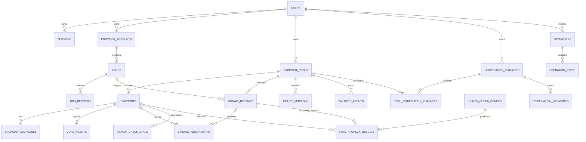

# MasterDNS 数据模型

## 1. 设计原则

- 使用 UUID 作为内部主键，不以厂商 ID 作为主键。
- 所有用户资源带 `owner_user_id`，管理员权限不改变资源所有权。
- 时间统一保存为 UTC `timestamptz`。
- 厂商标准字段结构化保存，无法统一的字段保存到 `provider_metadata jsonb`。
- 自动化期望状态、云端同步副本、操作过程和审计历史相互分离。
- 高频健康结果单独分区和保留，不与永久审计日志混合。

## 2. ER 图



## 3. 枚举

```text
user_role              admin | user
resource_status        active | disabled | error
provider_type          cloudflare | aliyun
record_management      unmanaged | managed
pool_strategy          primary_backup | healthy_set | assignment_pool
selection_mode         random | ordered | round_robin | least_assigned
recovery_mode          automatic | keep_current | manual | delayed
endpoint_address_mode  static | ddns
endpoint_lifecycle     enabled | disabled | maintenance | draining
health_state           unknown | healthy | degraded | unhealthy | recovering
operation_source       user | failover | recovery | ddns | drift | sync | rollback
operation_status       pending | running | succeeded | partial | failed | superseded
step_status            pending | running | succeeded | failed | skipped
notification_type      webhook | telegram
delivery_status        pending | delivered | retrying | failed
```

## 4. 身份与权限

### `users`

| 字段 | 说明 |
| --- | --- |
| `id` | UUID 主键 |
| `username` | 唯一、大小写不敏感 |
| `email` | 可空、存在时唯一 |
| `password_hash` | Argon2id hash |
| `role` | `admin/user` |
| `status` | `active/disabled` |
| `session_version` | 修改密码或禁用时递增，用于撤销全部会话 |
| `created_at/updated_at` | 时间 |

### `sessions`

保存随机 Session Token 的哈希而非明文。包含 `user_id`、`token_hash`、`session_version`、`expires_at`、`last_seen_at`、可选的设备摘要。

## 5. 云账号和 DNS 副本

### `provider_accounts`

| 字段 | 说明 |
| --- | --- |
| `id` | UUID |
| `owner_user_id` | 所有者 |
| `provider` | `cloudflare/aliyun` |
| `name` | 用户显示名称 |
| `credential_ciphertext` | 加密后的凭证包 |
| `credential_iv` | GCM IV |
| `credential_tag` | GCM Authentication Tag |
| `credential_key_version` | 主密钥版本 |
| `credential_hint` | 不敏感提示，例如 AccessKey ID 后四位 |
| `capabilities` | 验证得到的权限能力 JSON |
| `status/error_code` | 当前连接状态和稳定内部错误码 |
| `last_verified_at/last_synced_at` | 最近验证和同步 |

约束：凭证明文和完整 Token 不允许出现在任何其他字段。

### `zones`

包含 `provider_account_id`、`external_id`、`name_ascii`、`name_unicode`、`status`、`remote_hash`、`last_synced_at`。同一个账号内 `external_id` 唯一。

### `dns_records`

| 字段 | 说明 |
| --- | --- |
| `id` | 内部 UUID |
| `zone_id` | Zone |
| `external_id` | 厂商记录 ID |
| `type/name/content/ttl` | 标准字段 |
| `priority` | MX/SRV 等使用 |
| `provider_metadata` | `proxied/line/weight/status` 等 |
| `management` | `unmanaged/managed` |
| `managed_by_pool_id` | 受管时关联 Pool |
| `remote_hash` | 标准化远端内容摘要，用于漂移检测 |
| `last_synced_at` | 同步时间 |
| `deleted_at` | 软删除时间，保留历史关联 |

约束：`management=managed` 时必须存在 `managed_by_pool_id`。同一厂商可能用多条记录表示一个 `healthy_set`，不能假设 `name+type` 唯一。

## 6. IP Pool

### `endpoint_pools`

| 字段 | 说明 |
| --- | --- |
| `id/owner_user_id/name` | 标识与所有者 |
| `strategy` | 三种 Pool 类型 |
| `selection_mode` | 调度方式 |
| `recovery_mode` | 恢复方式 |
| `recovery_delay_seconds` | 延迟恢复时使用 |
| `failure_threshold` | 默认 3 |
| `success_threshold` | 默认 3 |
| `check_interval_seconds` | 默认 15 |
| `check_timeout_ms` | 默认 3000 |
| `switch_cooldown_seconds` | 默认 300 |
| `state` | 聚合运行状态 |
| `policy_revision` | 每次配置变化递增，用于拒绝过期决策 |
| `enabled_at/paused_at` | 自动化状态时间 |

### `endpoints`

| 字段 | 说明 |
| --- | --- |
| `id/pool_id/name` | 标识 |
| `address_mode` | `static/ddns` |
| `priority` | 顺序策略排序，数值越小优先级越高 |
| `lifecycle` | 启用、禁用、维护、排空 |
| `health_state` | 聚合健康状态 |
| `consecutive_successes/failures` | 当前阈值计数 |
| `last_checked_at/state_changed_at` | 检查与状态变化时间 |

节点不包含容量字段；健康节点允许承载任意数量的域名。

### `endpoint_addresses`

包含 `endpoint_id`、`family`（4/6）、`address`、`state`（candidate/current/previous）、`source`（static/ddns）、`observed_at`、`promoted_at`。每个节点和地址族最多一个 current、一个 candidate。

### `domain_bindings`

| 字段 | 说明 |
| --- | --- |
| `id/pool_id/zone_id` | 归属 |
| `fqdn/type` | 受管 DNS 名称和 A/AAAA 类型 |
| `original_endpoint_id` | assignment 模式的原始节点，可空 |
| `desired_revision` | 期望分配版本 |
| `state` | 正常、切换中、失败、漂移 |

### `binding_assignments`

`domain_binding_id + endpoint_id` 表示某节点当前或期望为域名服务。字段包含 `desired`、`applied`、`dns_record_id`、`reason`、`assigned_at`。

约束：

- `primary_backup` 和 `assignment_pool` 每个 Binding 同时最多一个 `desired=true`。
- `healthy_set` 允许多个健康 Endpoint 同时为 `desired=true`。
- `applied=true` 只能在 Provider 读取验证成功后设置。

### `policy_versions`

保存 `pool_id`、递增 `version`、完整规范化策略快照、变更原因、操作者和时间。版本不可更新或删除，用于审计和回滚。

## 7. 健康检查

### `health_check_configs`

字段包含：

- `checker_type`：`http/tcp`。
- `pool_id`、`endpoint_id`、`domain_binding_id` 中恰好一个非空。
- `config jsonb`：经过 Checker schema 验证后的结构化配置。
- `enabled`、`revision`、时间字段。

Pool 配置为默认值，Endpoint 配置覆盖 Pool，Domain Binding 配置覆盖 Endpoint。

### `health_check_results`

高频结果表，包含 `config_id`、`endpoint_id`、可选 `domain_binding_id`、可选 `probe_id`、`success`、`latency_ms`、`error_code`、截断脱敏的 `error_detail`、`checked_at`。

索引以 `(endpoint_id, checked_at desc)` 和 `(domain_binding_id, checked_at desc)` 为主。原始数据保留 30 天后按分区删除，聚合数据写入单独的小时/天统计表。

### `health_check_stats`

按 Endpoint 和可选 Domain Binding 保存小时、天级统计，包含样本数、成功数及平均/最小/最大延迟。默认保留 365 天，维护任务可在 Worker 重启后从仍在保留期内的原始结果重新生成。

## 8. DDNS Agent

### `ddns_agents`

每个动态 Endpoint 最多一条：

- `endpoint_id` 唯一。
- `install_token_hash/install_token_expires_at/install_token_used_at`。
- `runtime_token_hash`。
- `agent_version/hostname`。
- `last_seen_at/last_ip_changed_at`。
- `status/revoked_at`。

运行 Token 轮换时使用短暂重叠窗口，旧 Token 到期后只保留新 Token 哈希。

## 9. Operation 与审计

### `operations`

| 字段 | 说明 |
| --- | --- |
| `id` | Operation ID |
| `owner_user_id` | 资源所有者 |
| `actor_user_id` | 人工操作用户，自动任务可空 |
| `source` | user/failover/ddns 等 |
| `idempotency_key` | 唯一 |
| `resource_type/resource_id` | 目标资源 |
| `policy_revision` | 生成操作时的策略版本 |
| `status` | 整体状态 |
| `before_snapshot/desired_snapshot` | 变更前和期望结果 |
| `started_at/finished_at` | 执行时间 |

### `operation_steps`

每个远端变更一条，包含 `operation_id`、顺序、`provider_account_id`、`zone_id`、目标记录、动作 create/update/delete、状态、尝试次数、下次重试时间、脱敏错误、远端请求 ID、远端验证快照。

### `failover_events`

保存触发节点、受影响 Binding、策略决定、选择算法、候选集合、选择结果、健康证据、关联 Operation 和恢复事件。

### `audit_logs`

追加写入且不可修改，包含 actor、source、action、resource、before/after、request/event/operation ID、IP、User Agent、时间。凭证和 Token 字段在写入前移除。

## 10. 通知

### `notification_channels`

包含所有者、类型、名称、启用状态，以及加密后的 Webhook Secret 或 Telegram Bot Token。Webhook URL 和 Telegram Chat ID 可结构化保存，但展示时按敏感级别遮罩。

### `pool_notification_channels`

Pool 与 Channel 多对多关联，并包含事件过滤和是否覆盖用户默认渠道。

### `notification_deliveries`

保存事件 ID、Channel、状态、尝试次数、下次重试时间、HTTP 状态码、投递耗时、截断脱敏响应、发送时间。`event_id + channel_id` 唯一，防止重复投递。

## 11. 数据不变量

- 受管 DNS 记录只能由关联 Pool 的最新策略版本产生期望值。
- DNS Assignment 只有远端读取验证后才能标记 applied。
- DDNS candidate 地址只有健康检查成功后才能提升为 current。
- 全池故障不能生成删除最后活动 DNS 的 Operation。
- 已暂停 Pool 不自动生成 Provider 写操作，但继续按配置执行健康检查。
- 已禁用账号不允许生成新的远端写步骤。
- 回滚总是创建新 Operation 和新策略版本，不修改旧历史。
