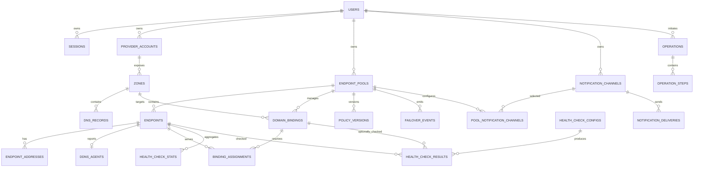
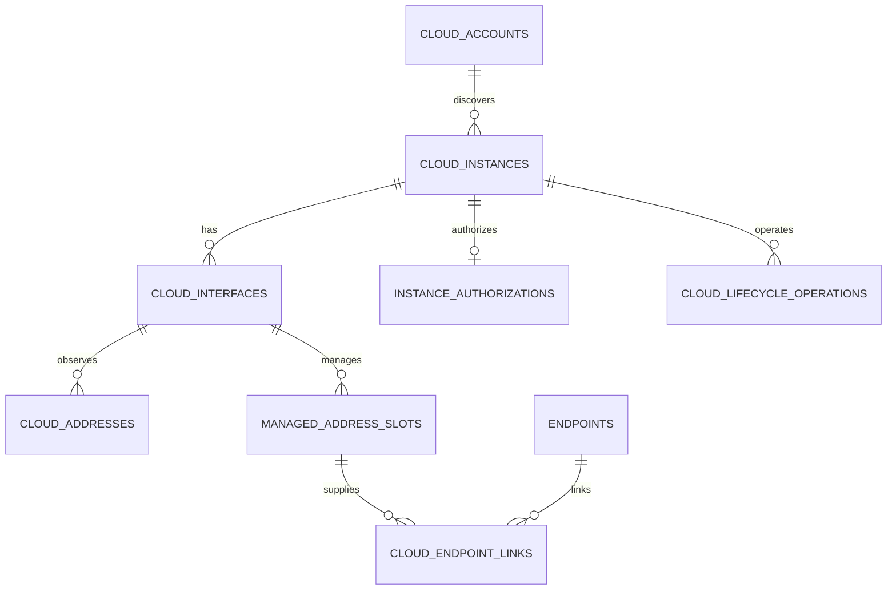

# MasterDNS 数据模型

本文按 2026-10-05、代码基线 `cc4b90d` 更新，描述实际持久对象及关键字段，不逐项复制完整 DDL。精确列、默认值、外键和索引以 [Drizzle schema](../packages/db/src/schema/index.ts) 与 [SQL 迁移](../packages/db/drizzle/) 为准；运行流程见[系统架构](ARCHITECTURE.md)。

## 1. 设计原则

- 多数业务实体使用 UUID 内部主键；关联表、换址步骤、物理资源锁等使用复合键或稳定文本键，厂商 ID 作为独立身份字段保存。
- 顶层用户资源保存 `owner_user_id`，子资源通过所属账号、Pool 或父对象确定所有权；管理员权限不改变资源所有权。
- 时间统一保存为 UTC `timestamptz`。
- 厂商标准字段结构化保存，无法统一的字段保存到 `provider_metadata` 或 `metadata` JSONB。
- 自动化期望状态、云端同步副本、操作过程和审计历史相互分离。
- 高频健康结果、聚合统计与审计日志分表保存。当前 Worker 按时间删除过期结果，未实现 PostgreSQL 分区表。

## 2. DNS 与 Pool 核心 ER 图

此图覆盖原有 DNS/Pool 主链，云资源关系见第 12 节，探测与换址表见第 13、14 节。


```mermaid
erDiagram
    USERS ||--o{ SESSIONS : owns
    USERS ||--o{ PROVIDER_ACCOUNTS : owns
    USERS ||--o{ ENDPOINT_POOLS : owns
    USERS ||--o{ NOTIFICATION_CHANNELS : owns
    PROVIDER_ACCOUNTS ||--o{ ZONES : exposes
    ZONES ||--o{ DNS_RECORDS : contains
    ENDPOINT_POOLS ||--o{ ENDPOINTS : contains
    ENDPOINT_POOLS ||--o{ DOMAIN_BINDINGS : manages
    ENDPOINT_POOLS ||--o{ POLICY_VERSIONS : versions
    ENDPOINT_POOLS ||--o{ FAILOVER_EVENTS : emits
    ENDPOINT_POOLS ||--o{ POOL_NOTIFICATION_CHANNELS : configures
    NOTIFICATION_CHANNELS ||--o{ POOL_NOTIFICATION_CHANNELS : selected
    ENDPOINTS ||--o{ ENDPOINT_ADDRESSES : has
    ENDPOINTS ||--o| DDNS_AGENTS : reports
    DOMAIN_BINDINGS ||--o{ BINDING_ASSIGNMENTS : resolves
    ENDPOINTS ||--o{ BINDING_ASSIGNMENTS : serves
    ZONES ||--o{ DOMAIN_BINDINGS : targets
    HEALTH_CHECK_CONFIGS ||--o{ HEALTH_CHECK_RESULTS : produces
    ENDPOINTS ||--o{ HEALTH_CHECK_STATS : aggregates
    ENDPOINTS ||--o{ HEALTH_CHECK_RESULTS : checked
    DOMAIN_BINDINGS ||--o{ HEALTH_CHECK_RESULTS : optionally_checked
    OPERATIONS ||--o{ OPERATION_STEPS : contains
    USERS ||--o{ OPERATIONS : initiates
    NOTIFICATION_CHANNELS ||--o{ NOTIFICATION_DELIVERIES : sends
```

## 3. 枚举

```text
user_role              admin | user
resource_status        active | disabled | error
provider_type          cloudflare | aliyun
record_management      unmanaged | managed
pool_strategy          primary_backup | healthy_set | assignment_pool
selection_mode         random | ordered | round_robin | least_assigned
recovery_mode          automatic | keep_current | manual | delayed
endpoint_address_mode  static | ddns | cloud
endpoint_lifecycle     enabled | disabled | maintenance | draining
health_state           unknown | healthy | degraded | unhealthy | recovering
operation_source       user | failover | recovery | ddns | drift | sync | rollback
operation_status       pending | running | succeeded | partial | failed | superseded
step_status            pending | running | succeeded | failed | skipped
notification_type      webhook | telegram
delivery_status        pending | delivered | retrying | failed
```

## 4. 身份与权限

### `users`

| 字段 | 说明 |
| --- | --- |
| `id` | UUID 主键 |
| `username` | 唯一、大小写不敏感 |
| `email` | 可空、存在时唯一 |
| `password_hash` | Argon2id hash |
| `role` | `admin/user` |
| `status` | `active/disabled` |
| `session_version` | 修改密码或禁用时递增，用于撤销全部会话 |
| `created_at/updated_at` | 时间 |

### `sessions`

保存随机 Session Token 的哈希而非明文。包含 `user_id`、`token_hash`、`session_version`、`expires_at`、`last_seen_at`、可选的设备摘要。

## 5. DNS 厂商账号和 DNS 副本

此处 `provider_accounts` 仅保存 DNS 厂商账号；云计算账号使用独立的 `cloud_accounts`，见第 12 节。

### `provider_accounts`

| 字段 | 说明 |
| --- | --- |
| `id` | UUID |
| `owner_user_id` | 所有者 |
| `provider` | `cloudflare/aliyun` |
| `name` | 用户显示名称 |
| `credential_ciphertext` | 加密后的凭证包 |
| `credential_iv` | GCM IV |
| `credential_tag` | GCM Authentication Tag |
| `credential_key_version` | 主密钥版本 |
| `credential_hint` | 不敏感提示，例如 AccessKey ID 后四位 |
| `capabilities` | 验证得到的权限能力 JSON |
| `status/error_code` | 当前连接状态和稳定内部错误码 |
| `last_verified_at/last_synced_at` | 最近验证和同步 |

约束：凭证明文和完整 Token 不允许出现在任何其他字段。

### `zones`

包含 `provider_account_id`、`external_id`、`name_ascii`、`name_unicode`、`status`、`remote_hash`、`last_synced_at`。同一个账号内 `external_id` 唯一。

### `dns_records`

| 字段 | 说明 |
| --- | --- |
| `id` | 内部 UUID |
| `zone_id` | Zone |
| `external_id` | 厂商记录 ID |
| `type/name/content/ttl` | 标准字段 |
| `priority` | MX/SRV 等使用 |
| `provider_metadata` | `proxied/line/weight/status` 等 |
| `management` | `unmanaged/managed` |
| `managed_by_pool_id` | 受管时关联 Pool |
| `remote_hash` | 标准化远端内容摘要，用于漂移检测 |
| `last_synced_at` | 同步时间 |
| `deleted_at` | 软删除时间，保留历史关联 |

约束：`management=managed` 时必须存在 `managed_by_pool_id`。同一厂商可能用多条记录表示一个 `healthy_set`，不能假设 `name+type` 唯一。

## 6. IP Pool

### `endpoint_pools`

| 字段 | 说明 |
| --- | --- |
| `id/owner_user_id/name` | 标识与所有者 |
| `strategy` | 三种 Pool 类型 |
| `selection_mode` | 调度方式 |
| `recovery_mode` | 恢复方式 |
| `recovery_delay_seconds` | 延迟恢复时使用 |
| `failure_threshold` | 默认 3 |
| `success_threshold` | 默认 3 |
| `check_interval_seconds` | 默认 15 |
| `check_timeout_ms` | 默认 3000 |
| `switch_cooldown_seconds` | 默认 300 |
| `state` | 聚合运行状态 |
| `policy_revision` | 策略配置版本，用于拒绝过期决策 |
| `decision_revision` | 调和决策版本，用于区分同一策略下的后续决策 |
| `round_robin_cursor/round_robin_cursors` | 轮询选择游标及按候选集区分的游标 |
| `enabled_at/paused_at` | 自动化状态时间 |

### `endpoints`

| 字段 | 说明 |
| --- | --- |
| `id/pool_id/name` | 标识 |
| `address_mode` | `static/ddns/cloud` |
| `priority` | 顺序策略排序，数值越小优先级越高 |
| `lifecycle` | 启用、禁用、维护、排空 |
| `health_state` | 聚合健康状态 |
| `consecutive_successes/failures` | 当前阈值计数 |
| `last_checked_at/state_changed_at` | 检查与状态变化时间 |

节点不包含容量字段；健康节点允许承载任意数量的域名。

### `endpoint_addresses`

包含 `endpoint_id`、`family`（4/6）、`address`、`state`（candidate/current/previous）、`source`（static/ddns/cloud）、地址级健康状态与连续成功/失败计数、`last_checked_at`、`observed_at`、`promoted_at`、`replaced_at`。部分唯一索引保证每个节点和地址族最多一个 current、一个 candidate；previous 可有多条。

### `domain_bindings`

| 字段 | 说明 |
| --- | --- |
| `id/pool_id/zone_id` | 归属 |
| `fqdn/record_type` | 受管 DNS 名称和 A/AAAA 类型 |
| `ttl/provider_metadata` | 期望 TTL 与厂商参数 |
| `original_endpoint_id` | assignment 模式的原始节点，可空 |
| `desired_revision` | 期望分配版本 |
| `state` | 正常、切换中、失败、漂移 |

### `binding_assignments`

`domain_binding_id + endpoint_id` 表示某节点当前或期望为域名服务。字段包含 `desired`、`applied`、`dns_record_id`、`reason`、`assigned_at`。

约束：

- `primary_backup` 和 `assignment_pool` 每个 Binding 同时最多一个 `desired=true`。
- `healthy_set` 允许多个健康 Endpoint 同时为 `desired=true`。
- `applied=true` 只能在 Provider 读取验证成功后设置。

### `policy_versions`

保存 `pool_id`、递增 `version`、完整规范化策略快照、变更原因、操作者和时间。按追加历史使用，用于审计和回滚；资源删除的保留边界仍由外键和删除流程决定。

## 7. 健康检查

### `health_check_configs`

字段包含：

- `checker_type`：`http/tcp`。
- `pool_id`、`endpoint_id`、`domain_binding_id`、`slot_id` 中恰好一个非空。
- `config jsonb`：经过 Checker schema 验证后的结构化配置。
- `enabled`、`revision`、时间字段。

Pool 配置为默认值，Endpoint 配置覆盖 Pool，Domain Binding 配置覆盖 Endpoint。

### `health_check_results`

高频结果表，包含 `config_id`、`endpoint_id`、可选 `endpoint_address_id`、可选 `domain_binding_id`、可选 `probe_id`、`success`、`latency_ms`、`error_code`、截断脱敏的 `error_detail`、`checked_at`。

索引覆盖节点、节点地址和 Binding 与检查时间的组合。原始数据默认保留 30 天，聚合数据写入小时/天统计表；Worker 使用按时间条件删除的维护任务，保留期可配置。

### `health_check_stats`

按 Endpoint 和可选 Domain Binding 保存小时、天级统计，包含样本数、成功数及平均/最小/最大延迟。默认保留 365 天，维护任务可在 Worker 重启后从仍在保留期内的原始结果重新生成。

### `binding_endpoint_health`

以 DomainBinding + Endpoint 为主键，保存该域名上下文下的节点健康状态、对应地址、连续计数和检查时间。与节点级及地址级健康分开，避免一个域名的检查结果无条件替代另一个域名的结果。

## 8. DDNS Agent

### `ddns_agents`

每个动态 Endpoint 最多一条：

- `endpoint_id` 唯一。
- `install_token_hash/install_token_expires_at/install_token_used_at`。
- `runtime_token_hash`。
- `agent_version/hostname`。
- `last_seen_at/last_ip_changed_at`。
- `status/revoked_at`。

运行 Token 轮换时使用短暂重叠窗口，旧 Token 到期后只保留新 Token 哈希。

## 9. Operation 与审计

### `operations`

| 字段 | 说明 |
| --- | --- |
| `id` | Operation ID |
| `owner_user_id` | 资源所有者 |
| `actor_user_id` | 人工操作用户，自动任务可空 |
| `source` | user/failover/ddns 等 |
| `idempotency_key` | 唯一 |
| `resource_type/resource_id` | 目标资源 |
| `policy_revision/decision_revision` | 生成操作时的策略与决策版本 |
| `status` | 整体状态 |
| `before_snapshot/desired_snapshot` | 变更前和期望结果 |
| `started_at/finished_at` | 执行时间 |

### `operation_steps`

每个远端变更一条，包含 `operation_id`、顺序、`provider_account_id`、`zone_id`、目标记录、动作 create/update/delete、状态、尝试次数、下次重试时间、脱敏错误、远端请求 ID、远端验证快照。

### `failover_events`

保存触发节点、受影响 Binding、策略决定、选择算法、候选集合、选择结果、健康证据、关联 Operation 和恢复事件。

### `reconcile_intents`

Pool 调和 Outbox，保存唯一 `event_id`、`pool_id`、可选 Endpoint、策略/决策版本、trigger、source、force、`available_at` 和 `completed_at`。业务状态与意图在事务中持久化，Worker 周期扫描未完成意图并投递队列。

### `audit_logs`

按追加历史使用，包含 actor、source、action、resource、before/after、request/event/operation ID、IP、User Agent、时间。凭证和 Token 字段在写入前移除。

## 10. 通知

### `notification_channels`

包含所有者、类型、名称、启用状态，以及加密后的 Webhook Secret 或 Telegram Bot Token。目的地址统一保存在 `endpoint`，另有 `enabled` 和 `is_default`。

### `pool_notification_channels`

Pool 与 Channel 多对多关联，并包含事件过滤和是否覆盖用户默认渠道。

### `notification_deliveries`

保存事件 ID、Channel、状态、尝试次数、下次重试时间、HTTP 状态码、投递耗时、截断脱敏响应、发送时间。`event_id + channel_id` 唯一，防止重复创建投递记录；远端已收到但响应丢失时仍可能重试，接收方应按事件 ID 去重。

## 11. DNS 与 DDNS 业务不变量

以下由数据库约束与业务事务/执行器共同维护，不代表每项都有独立的数据库 CHECK 或触发器。

- 受管 DNS 记录只能由关联 Pool 的最新策略版本产生期望值。
- DNS Assignment 只有远端读取验证后才能标记 applied。
- DDNS candidate 地址只有健康检查成功后才能提升为 current。
- 全池故障不能生成删除最后活动 DNS 的 Operation。
- 已暂停 Pool 不自动生成 Provider 写操作，但继续按配置执行健康检查。
- 已禁用账号不允许生成新的远端写步骤。
- 回滚总是创建新 Operation 和新策略版本，不修改旧历史。

## 12. 云资源与实例生命周期

云资源 schema 位于 [cloud.ts](../packages/db/src/schema/cloud.ts)，生命周期表位于 [cloud-lifecycle.ts](../packages/db/src/schema/cloud-lifecycle.ts)。


```mermaid
erDiagram
    CLOUD_ACCOUNTS ||--o{ CLOUD_INSTANCES : discovers
    CLOUD_INSTANCES ||--o{ CLOUD_INTERFACES : has
    CLOUD_INTERFACES ||--o{ CLOUD_ADDRESSES : observes
    CLOUD_INTERFACES ||--o{ MANAGED_ADDRESS_SLOTS : manages
    MANAGED_ADDRESS_SLOTS ||--o{ CLOUD_ENDPOINT_LINKS : supplies
    ENDPOINTS ||--o{ CLOUD_ENDPOINT_LINKS : links
    CLOUD_INSTANCES ||--o| INSTANCE_AUTHORIZATIONS : authorizes
    CLOUD_INSTANCES ||--o{ CLOUD_LIFECYCLE_OPERATIONS : operates
```

图中为主要关联，不表示每个业务身份都由外键表达。

| 表 | 关键内容与用途 |
| --- | --- |
| `cloud_accounts` | AWS/Azure/Linode 账号、外部账号身份、加密凭证、区域范围、代理关联和启用状态 |
| `cloud_proxy_profiles` | 所有者范围内的共享加密代理配置 |
| `cloud_scan_scopes` | 按账号/服务/区域保存扫描 generation、开始/完成时间和错误 |
| `cloud_instances` | 服务、区域、远端实例 ID、状态、元数据与扫描代次 |
| `cloud_interfaces` | 实例下的远端接口及元数据 |
| `cloud_addresses` | host/prefix、IPv4/IPv6、地址、远端 allocation ID、user/system 来源、inventory_present 和尝试关联 |
| `managed_address_slots` | 接口/地址族下的稳定槽位，current/candidate 地址引用及各自版本 |
| `instance_authorizations` | managed、IPv4/IPv6 换址、停启、删除、地址释放权限及授权 revision |
| `cloud_endpoint_links` | Endpoint/地址族到 Slot 的关联 |
| `cloud_api_requests` | API 动作的请求哈希、幂等键及结果 |
| `cloud_idle_ip_cleanups` | 空闲 IP 清理预览、确认范围、账号/凭证身份、结果与有效期 |
| `cloud_instance_controls` | 按实际实例 physical_key 保存 manual_stop/traffic_limit/deleted hold |
| `cloud_traffic_stop_policies` | 月流量方向和阈值、策略版本、检查时间、观测值及扫描租约 |
| `cloud_lifecycle_operations` | start/stop/delete 的请求、授权上下文、执行快照、租约、下次运行和结果 |

生命周期操作状态为 `queued/in_flight/succeeded/failed/unknown/cancelled`，部分唯一索引限制同一 physical_key 只能有一个 queued/in_flight/unknown 操作。远端请求不确定时保留 unknown 并继续观察，不能仅因客户端超时认定云端未执行。

Slot 的 current/candidate 指向云地址；EndpointAddress 是供 DNS 调度使用的地址视图。库存存在、候选验证、地址提升、DNS 应用和旧资源释放是不同事实，不得合并为一个“成功”字段。

## 13. 多探针与地址健康证据

schema 位于 [probes.ts](../packages/db/src/schema/probes.ts)。健康目标可以是云 Slot 或普通 Endpoint/地址族；具体互斥和唯一约束以 schema 为准。

| 表 | 关键内容与用途 |
| --- | --- |
| `probe_agents` | 探针所有者、启用/撤销状态、能力、并发上限、版本和最后心跳 |
| `probe_tokens` | 安装/运行 Token 哈希、有效期、使用和撤销时间 |
| `probe_groups` / `probe_group_members` | 探针组成员及组版本 |
| `address_health_policies` | 目标、地址族、检查配置、模式、探针组、共识规则、时间窗口、阈值和网络策略 |
| `probe_round_sequences` | 每个目标/地址族的持久递增轮次序号 |
| `probe_rounds` | 一轮检查冻结的地址/配置/策略/组版本、成员、截止与过期时间、共识结果和应用时间 |
| `probe_tasks` | 指定 Probe 的轮次任务、lease_id、租约截止及完成时间 |
| `probe_observations` | 回传的租约与版本、接收状态、success/failure/unavailable 结果、延迟及接收时间 |
| `address_health_states` | 版本化健康状态、连续计数、最新轮次/序号、latest_decision、evidence_expires_at、下次检查时间 |
| `probe_observation_stats` | 按目标/探针/地址族及小时/天聚合的成功、有效与不可用样本统计 |

任务、轮次、观测分表的原因：一次网络回传可能重复、迟到或来自旧租约，不能收到结果就直接改变节点健康。接收和应用流程需判断身份、任务归属、版本、轮次顺序与时效。

聚合状态可能保留上一结果；`latest_decision=unknown` 或证据过期不等于新的失败，也不能作为新的成功发布依据。地址、检查配置、策略和探针组版本将健康证据绑定到特定上下文。

## 14. 换址、发布与清理

schema 位于 [rotation.ts](../packages/db/src/schema/rotation.ts)。

| 表 | 关键内容与用途 |
| --- | --- |
| `rotation_policies` | Slot 策略开关/版本、尝试上限、间隔、云端等待、候选窗口和 Linode 重启/换址方式 |
| `rotation_schedules` | Slot 周期计划、下次时间、关联事件、最近处理标记和暂停原因 |
| `rotation_incidents` | 一次换址事件，触发源、物理身份、状态/阶段、捕获的授权/策略/健康版本、运行时间及终止时间 |
| `rotation_budget_segments` | 尝试预算段、已用次数、是否耗尽及操作人 |
| `rotation_attempts` | 事件内的实际尝试、序号、换址前清单、候选身份和记账状态 |
| `rotation_steps` | 持久 CloudStep 计划、执行状态、receipt、fence、派发/观察/重试时间 |
| `rotation_step_observations` | 步骤执行/观察回执历史 |
| `rotation_leases` | 按 physical_key 保存 holder、递增 revision、到期时间及未决步骤 |
| `rotation_publications` | Slot/address_version 对应发布，关联 Incident（可空）、子 Pool 决策和 DNS Operation、旧 TTL、提升及应用时间 |
| `rotation_resources` | 原地址/候选的来源、归属证据、远端身份、附着/引用状态与清理进度 |

主要状态取值：

```text
incident.trigger    health | manual | scheduled
incident.status     active | paused | exhausted | complete
incident.phase      cloud | candidate | publish | cleanup | complete
step.status         prepared | in_flight | pending | applied | not_applied
                    ambiguous | rejected_no_effect | abandoned
publication.status  pending | in_flight | applied | failed
resource.cleanup    retained | pending | released | failed
```

关键约束与解释：

- 同一 Slot/地址族最多一个未 complete 的 Incident；Slot/source_event_id 唯一，重复触发复用已有事件。
- Attempt 在 Incident 内序号唯一；Step 在 Attempt 内序号唯一。
- Publication 按 Slot/address_version 唯一，首次绑定发布可以没有 Incident。
- Incident 同时保存 status 和 phase，终止另存 `terminated_at`。不能把 `complete` 单独当作“所有业务效果成功”的证明。
- health/scheduled 事件保存探测上下文版本；manual 事件对应字段为空，不能伪造为已通过外部探测。
- Linode 临时实例身份保存在步骤 receipt 和资源 snapshot 中，通过 [rotation-temporary-instances.ts](../packages/db/src/rotation-temporary-instances.ts) 提取，并无独立临时实例表。
- `charged` 表示尝试预算记账；恢复原步骤不创建一次新的换址尝试。

账号/服务层面的速率准入另由 [cloud-rotation-limits.ts](../packages/db/src/schema/cloud-rotation-limits.ts) 中的 `cloud_rotation_limit_switches`、`cloud_rotation_limit_policies`、`cloud_rotation_buckets`、`cloud_rotation_reservations` 保存。该限制与单次事件的尝试次数预算职责不同。

## 15. 状态推进与持久边界

| 事实 | 主要写入路径 | 下游如何使用 |
| --- | --- | --- |
| 配置与授权 | API Service + 数据库事务 | Worker 派发/发布前再次检查版本与有效性 |
| DNS/云清单 | 同步 Worker、执行后的远端观察 | 提供实际状态副本，不直接授予发布或释放权限 |
| 本地健康 | HealthResultService | 维护节点/地址/Binding 状态并触发调和 |
| Probe 轮次与证据 | API 接收结果、Worker 收束轮次，共享 db 事务 | Pool 可用性判断及自动换址/发布准入 |
| DNS 期望 | ReconcileProcessor | OperationProcessor 执行与验证 |
| 换址意图与步骤 | RotationStore/Processor | 恢复扫描继续执行或观察原步骤 |
| 地址发布与清理 | Publication/Cleanup Service + DNS 执行器 | 分别证明新地址发布与旧资源处理结果 |
| 通知投递 | NotificationProcessor | 持久重试与历史展示 |

数据库唯一键、外键、事务锁、租约和业务版本校验共同维护状态；Redis 锁还参与 DNS 等执行路径的互斥。不能把共享数据库解释为所有外部副作用都能在一个事务内提交或回滚。

健康数据默认原始保留 30 天、统计保留 365 天，由 Worker 聚合和清理。迁移只向前执行；数据库恢复必须同时考虑云端已有副作用及独立保存的主加密密钥，操作步骤见[部署手册](DEPLOYMENT.md)。
